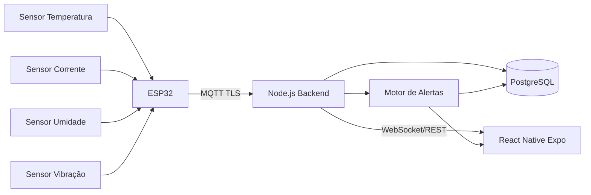

# TCC-ENG-COMPUTA-O

Desenvolvimento de um sistema IoT de baixo custo para monitoramento preventivo de barramentos elétricos industriais.

## 1) Arquitetura completa do sistema

### Visão geral
A solução é dividida em 4 camadas principais:

1. **Camada de aquisição (Edge/ESP32)**
   - ESP32 lê sensores de **temperatura**, **corrente**, **umidade** e **vibração**.
   - Executa pré-processamento local (filtro simples, média móvel, validação de faixa).
   - Publica dados via **MQTT sobre TLS** (ou HTTP fallback para contingência).

2. **Camada de ingestão e processamento (Backend Node.js)**
   - API/serviço de ingestão recebe telemetria dos dispositivos.
   - Valida payload, autentica dispositivo por token/chave e registra no banco.
   - Processa regras de alerta (thresholds e tendência de aumento).
   - Notifica clientes em tempo real (WebSocket/Socket.IO).

3. **Camada de dados (PostgreSQL)**
   - Armazena cadastro de ativos, dispositivos, medições, alertas e histórico.
   - Índices por timestamp e dispositivo para consultas rápidas.
   - Pronto para evoluir para particionamento por data no futuro.

4. **Camada de visualização (App React Native com Expo)**
   - Dashboard por barramento/linha.
   - Gráficos de tendência e histórico.
   - Alertas críticos com priorização por severidade.

### Diagrama lógico



### Requisitos não funcionais sugeridos
- **Baixo custo:** priorizar sensores amplamente disponíveis e ESP32 DevKit.
- **Confiabilidade:** buffer local no ESP32 para perda temporária de rede.
- **Segurança:** TLS, autenticação por dispositivo e rotação de credenciais.
- **Escalabilidade inicial:** arquitetura monolítica modular no backend (simples para MVP).

---

## 2) Divisão em módulos

### Firmware (ESP32)
- `sensor_manager`: leitura dos 4 sensores e calibração.
- `signal_processing`: filtros, média móvel, cálculo RMS (corrente) e features de vibração.
- `connectivity`: Wi-Fi, MQTT, reconexão e heartbeat.
- `payload_builder`: serialização JSON, timestamp e ID do dispositivo.
- `local_buffer`: fila local em caso de indisponibilidade de rede.
- `device_config`: parâmetros remotos (intervalo de coleta, limiares básicos).

### Backend (Node.js)
- `auth`: autenticação de dispositivo e usuário.
- `ingestion`: endpoint MQTT/HTTP para telemetria.
- `telemetry_service`: validação, normalização e persistência.
- `alert_engine`: regras por faixa + tendência + correlação simples entre sensores.
- `asset_management`: cadastro de planta, painel, barramento e dispositivo.
- `notification_gateway`: push in-app e eventos em tempo real.
- `reporting`: consultas de histórico, exportação e KPIs.

### App (React Native + Expo)
- `auth`: login e sessão.
- `dashboard`: status em tempo real por ativo.
- `asset_detail`: gráfico temporal de temperatura/corrente/umidade/vibração.
- `alerts`: lista, detalhe, reconhecimento (ack) e histórico.
- `settings`: limiares por ativo e preferências de notificação.

---

## 3) Fluxo de dados do sensor até o app

1. **Coleta local (ESP32)**
   - Leitura periódica (ex.: 1 amostra/s; pacote consolidado a cada 5s).
2. **Pré-processamento**
   - Filtra ruído, agrega janela curta, valida faixas plausíveis.
3. **Empacotamento**
   - Payload JSON com: `deviceId`, `assetId`, `timestamp`, medições e qualidade de sinal.
4. **Transmissão**
   - Publicação em tópico MQTT (ex.: `plant1/busbar/{deviceId}/telemetry`).
5. **Ingestão backend**
   - Backend autentica dispositivo, valida schema e grava telemetria no PostgreSQL.
6. **Processamento de alertas**
   - Regras de limite (ex.: temperatura > 80°C) e tendência (ex.: subida contínua).
7. **Disponibilização ao app**
   - App busca histórico via REST e recebe alertas/atualizações por WebSocket.
8. **Ação do usuário**
   - Operador visualiza alerta, reconhece evento e abre ordem de manutenção preventiva.

Exemplo de payload:

```json
{
  "deviceId": "esp32-001",
  "assetId": "busbar-A1",
  "timestamp": "2026-03-10T12:00:00Z",
  "temperatureC": 67.4,
  "currentA": 152.8,
  "humidityPct": 54.2,
  "vibrationRms": 0.83,
  "signalQuality": "ok"
}
```

---

## 4) Estrutura de pastas (firmware, backend e app)

```text
tcc-iot-busbar/
├─ firmware-esp32/
│  ├─ src/
│  │  ├─ main.cpp
│  │  ├─ config/
│  │  ├─ sensors/
│  │  │  ├─ temperature/
│  │  │  ├─ current/
│  │  │  ├─ humidity/
│  │  │  └─ vibration/
│  │  ├─ processing/
│  │  ├─ comm/
│  │  └─ storage/
│  ├─ include/
│  ├─ test/
│  ├─ platformio.ini
│  └─ README.md
│
├─ backend-node/
│  ├─ src/
│  │  ├─ modules/
│  │  │  ├─ auth/
│  │  │  ├─ ingestion/
│  │  │  ├─ telemetry/
│  │  │  ├─ alerts/
│  │  │  ├─ assets/
│  │  │  └─ notifications/
│  │  ├─ common/
│  │  ├─ config/
│  │  └─ app.ts
│  ├─ prisma/ (ou migrations SQL)
│  ├─ test/
│  ├─ package.json
│  └─ README.md
│
└─ app-mobile-expo/
   ├─ src/
   │  ├─ screens/
   │  ├─ components/
   │  ├─ services/
   │  ├─ hooks/
   │  ├─ store/
   │  ├─ navigation/
   │  └─ theme/
   ├─ assets/
   ├─ app.json
   ├─ package.json
   └─ README.md
```

---

## 5) Plano MVP (6 a 8 semanas)

### Semana 1 — Especificação e setup
- Definir requisitos funcionais e limites iniciais de alerta.
- Selecionar sensores e validar pinagem no ESP32.
- Subir repositórios e padrão de versionamento.

### Semana 2 — Firmware base
- Leitura individual dos 4 sensores com calibração inicial.
- Estruturar payload e timestamp.
- Testes de bancada com logs seriais.

### Semana 3 — Conectividade e ingestão
- Implementar MQTT/HTTP no ESP32.
- Criar backend Node.js com endpoint de ingestão.
- Persistir telemetria no PostgreSQL.

### Semana 4 — Regras de alerta
- Implementar motor de alertas por limiar.
- Criar entidades: ativos, dispositivos, medições e alertas.
- Endpoint de consulta histórica e alertas ativos.

### Semana 5 — App mobile (v1)
- Login simples.
- Dashboard com último valor por sensor.
- Tela de alertas em tempo real.

### Semana 6 — Integração ponta a ponta
- Teste completo sensor → backend → app.
- Ajuste de frequência de envio e consumo de energia.
- Tratamento de perda de conexão e buffer local.

### Semana 7 — Validação técnica
- Testes com cenários simulados (sobrecorrente, aquecimento, vibração anômala).
- Medir latência de ponta a ponta e taxa de perda de pacotes.
- Refinar thresholds para reduzir falso positivo.

### Semana 8 — Documentação e apresentação
- Consolidar arquitetura final e resultados.
- Gerar gráficos comparativos e estudo de custo.
- Preparar demo + material de banca.

## Entregáveis mínimos do MVP
- Um nó ESP32 funcional com 4 sensores e envio contínuo.
- Backend persistindo telemetria e gerando alertas.
- App exibindo dashboard, histórico curto e alertas.
- Relatório com custo estimado, limitações e próximos passos.
